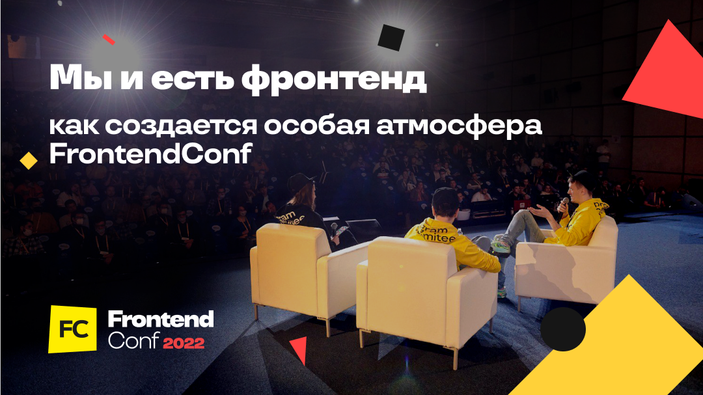

## Мы и есть фронтенд: как создается особая атмосфера FrontendConf
[Блог компании Конференции Олега Бунина(Онтико)](https://habr.com/ru/company/oleg-bunin/blog/),[Программирование*](https://habr.com/ru/hub/programming/),[Управление сообществом](https://habr.com/ru/hub/community_management/),[Конференции](https://habr.com/ru/hub/tech_events/)
[FrontendConf](https://frontendconf.ru/) входит в группу конференций Олега Бунина «Онтико». Это профессиональное
мероприятие для фронтенд-разработчиков различных грейдов. Его организацией занимается
программный комитет: ищет спикеров, готовит программу, помогает сделать доклады
интересными и полезными. Как всё устроено изнутри и
можно ли стать частью этого большого и важного дела, рассказывают члены программного комитета.

Знакомьтесь с программным комитетом FrontendConf

Глеб Михеев — CTO Skillbox Holding, руководитель программного комитета FrontendConf, спикер 
отраслевых конференций.

Андрей Смирнов — руководитель управления клиентской разработки в X5 Group. Бессменный
ведущий подкаста Frontend Weekend. Участник программного комитета FrontendConf и спикер
российских отраслевых конференций.

Серёжа Попов — CEO аутсорса по фронтенд-разработке Лига А. Ментор и наставник начинающих
специалистов, преподаватель авторских курсов, лекций и воркшопов по фронтенд-разработке.
Спикер российских и международных отраслевых конференций.

##Формируем программный комитет

Сейчас у нас в программном комитете 10 человек. Участие в программном комитете конференции 
— это работа, но каждый тратит на неё столько времени, сколько может. Кто-то вкладывается 
больше, кто-то меньше, но в результате комитет работает как единый слаженный механизм. 

Например, Саша Шинкевич и Ваня Ботанов очень много занимаются своими проектами, у них 
остаётся на конференцию не так много времени. Тем не менее есть моменты, когда команда 
целенаправленно ждёт их экспертизы.

Кто сильнее вкладывается, видно по количеству докладчиков. У одних это 15 человек, у других 3-
7. Всё зависит от личной и рабочей загрузки и предварительного планирования. Также загрузка 
может меняться от сезона к сезону.

В программный комитет приглашают новых людей, когда возникает такая потребность — иногда 
кто-то покидает его «по выслуге лет», из-за переезда или рождения ребенка. Когда появляется
вакантное место,  начинаются поиски нового человека с необходимой экспертизой и 
компетенциями. Ведь каждый участник комитета дополняет других своими навыками и умениями.